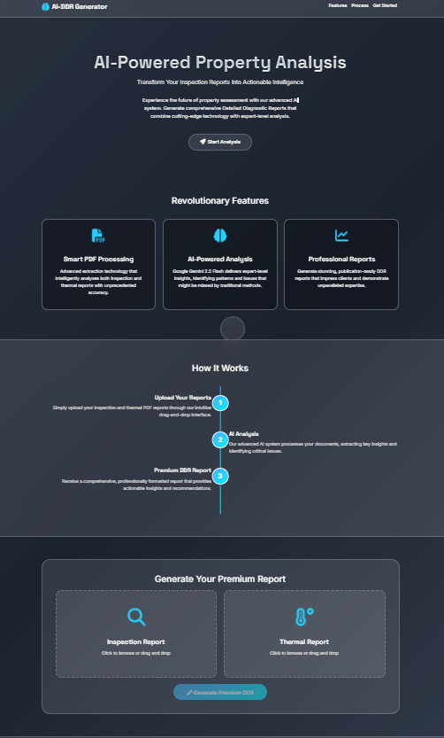

# AI-Powered Detailed Diagnostic Report (DDR) Generator

A comprehensive Python application that generates Detailed Diagnostic Reports (DDR) from inspection and thermal PDF documents using AI analysis.

## 📺 Demo Video
> **[▶️ Watch the Project Demo & Walkthrough](https://www.loom.com/share/8d58001dfbb4474ea99f08a01fbc0ba2)**

## � Features

- **PDF Processing**: Extract text and images from inspection and thermal reports
- **AI Analysis**: Uses Google Gemini AI for intelligent report analysis
- **Multiple Interfaces**: Both command-line and web-based interfaces
- **Structured Output**: Generates professional DDR reports with 7 key sections
- **Image Integration**: Automatically extracts and includes relevant images
- **Error Handling**: Robust error handling and logging throughout
- **Reusable**: Works with any similar inspection and thermal reports
- **Environment Configuration**: Secure API key management via .env file

## 📸 Screenshots

### Web Interface


### Generated Report Preview
.png)

## 📋 Report Structure

The generated DDR includes:
1. **Property Issue Summary** - All identified issues
2. **Area-wise Observations** - Location-specific findings
3. **Probable Root Cause** - Analysis of likely causes
4. **Severity Assessment** - Risk evaluation with reasoning
5. **Recommended Actions** - Prioritized action items
6. **Additional Notes** - Relevant observations
7. **Missing or Unclear Information** - Gaps in data

## 🛠️ Installation

### Prerequisites
- Python 3.8 or higher
- Google Gemini API key

### Setup Steps

1. **Clone or download the project**
   ```bash
   git clone <repository-url>
   cd AI-DDR-REPORT-GENERATOR
   ```

2. **Install dependencies**
   ```bash
   pip install -r requirements.txt
   ```

3. **Set up environment variables**
   - Copy the example environment file:
     ```bash
     copy .env.example .env
     ```
   - Edit the `.env` file and update your Google Gemini API key:
     ```
     GEMINI_API_KEY=your_actual_api_key_here
     ```
   - Get your API key from [Google AI Studio](https://makersuite.google.com/app/apikey)

## 🎯 Usage

### Command Line Interface

1. **Run the application**
   ```bash
   python main.py
   ```

2. **Provide input files when prompted**
   - Enter path to Inspection Report PDF
   - Enter path to Thermal Report PDF

3. **View the results**
   - DDR content displayed in console
   - PDF report saved to `output/` directory
   - Images extracted to `output/inspection_images/` and `output/thermal_images/`

### Web Interface

1. **Start the web server**
   ```bash
   python web_app.py
   ```

2. **Open your browser**
   - Navigate to `http://localhost:5000`

3. **Upload files**
   - Upload Inspection Report PDF
   - Upload Thermal Report PDF
   - Click "Generate DDR Report"

4. **Download results**
   - View generated DDR online
   - Download PDF report
   - Access extracted images

### Example Session
```
============================================================
AI-POWERED DETAILED DIAGNOSTIC REPORT (DDR) GENERATOR
============================================================

Enter path to Inspection Report PDF: C:\reports\inspection.pdf
Enter path to Thermal Report PDF: C:\reports\thermal.pdf

✅ DDR GENERATION COMPLETED SUCCESSFULLY!
============================================================
📄 Report saved to: output/DDR_Report_20240318_143022.pdf
🖼️  Images extracted: 12
📝 Log file: ddr_generator.log
```

## 📁 Project Structure

```
AI-DDR-REPORT-GENERATOR/
├── main.py                 # Command-line execution script
├── web_app.py             # Flask web application
├── pdf_extractor.py        # PDF text and image extraction
├── ai_processor.py         # AI processing with Gemini API
├── report_generator.py     # PDF report generation
├── config.py              # Configuration and error handling
├── requirements.txt        # Python dependencies
├── .env.example           # Environment variables template
├── .env                   # Environment variables (create from .env.example)
├── README.md              # This file
├── templates/             # Web interface templates
│   ├── index.html        # Main upload page
│   └── result.html       # Results display page
├── uploads/               # Temporary file uploads
└── output/                # Generated reports and images
    ├── DDR_Report_*.pdf   # Generated DDR reports
    ├── inspection_images/ # Extracted inspection images
    ├── thermal_images/    # Extracted thermal images
    └── ddr_generator.log  # Application log
```

## 🔧 Configuration

### Environment Variables
Edit the `.env` file to configure:
- `GEMINI_API_KEY`: Your Google Gemini API key (required)
- `FLASK_SECRET_KEY`: Flask application secret key
- `DEBUG`: Enable/disable debug mode (True/False)
- `UPLOAD_FOLDER`: Temporary upload directory
- `OUTPUT_FOLDER`: Output directory for reports
- `MAX_CONTENT_LENGTH`: Maximum file upload size in bytes
- `LOG_FILE`: Path to application log file

### Advanced Configuration
For advanced settings, edit `config.py`:
- `max_images_per_section`: Maximum images to include (default: 5)
- `max_text_length`: Maximum text characters for AI processing (default: 50000)
- Report formatting and PDF settings

#### 🤖 Changing the AI Model
To achieve better results or use a more capable model (like Gemini 1.5 Pro), you can change the model configuration:

1. Open `ai_processor.py`.
2. Locate the model initialization (around line 30):
   ```python
   self.model = genai.GenerativeModel('gemini-2.5-flash')
   ```
3. Change the model name to your preference:
   - `'gemini-1.5-pro'` (Better reasoning, higher quality analysis)
   - `'gemini-1.5-flash'` (Faster, standard performance)

## 🤖 AI Processing

The system uses Google Gemini 1.5 Pro with a specialized prompt that:
- Analyzes combined inspection and thermal data
- Avoids hallucination and fake data
- Clearly indicates missing information
- Provides structured, client-friendly output
- Handles data conflicts transparently

## 📊 Supported File Formats

### Input
- **PDF files**: Inspection reports, Thermal reports
- **Image extraction**: PNG, JPG, JPEG, BMP, TIFF

### Output
- **DDR Report**: Professional PDF with structured sections
- **Images**: Extracted and organized by report type
- **Logs**: Detailed processing logs

## ⚠️ Important Notes

### Data Handling
- **No Hallucination**: AI only uses provided data
- **Missing Data**: Clearly marked as "Not Available"
- **Conflicts**: Explicitly mentioned when detected
- **Client-Friendly**: Simple, non-technical language

### Limitations
- Requires readable PDF files
- Image mapping is based on page numbers
- AI processing depends on quality of input documents
- Large PDFs may take longer to process

## 🐛 Troubleshooting

### Common Issues

1. **Environment Configuration**
   - Ensure `.env` file exists and is properly configured
   - Verify `GEMINI_API_KEY` is set correctly in `.env`
   - Check that `.env` file is in the project root directory

2. **PDF Not Found**
   - Ensure file paths are correct
   - Use absolute paths if needed
   - For web interface, check file upload limits

3. **API Key Error**
   - Verify Gemini API key is valid and active
   - Check internet connection
   - Ensure API key has sufficient quota

4. **Web Server Issues**
   - Check if port 5000 is available
   - Verify Flask dependencies are installed
   - Check browser console for JavaScript errors

5. **Memory Issues**
   - Reduce PDF size if possible
   - Close other applications
   - Adjust `MAX_CONTENT_LENGTH` in `.env` if needed

6. **Image Extraction Fails**
   - Check PDF permissions
   - Verify PDF is not encrypted
   - Ensure sufficient disk space in output directory

### Logging
Check `ddr_generator.log` for detailed error information:
```bash
tail -f output/ddr_generator.log
```

## 🔒 Security Considerations

- **API Key**: Store securely in `.env` file, never commit to version control
- **Environment File**: `.env` is included in `.gitignore` to protect sensitive data
- **Data Privacy**: Processed data sent to Google Gemini API
- **Local Storage**: Images and reports stored locally
- **Web Security**: Flask app includes secure file handling and input validation
- **No Cloud Upload**: No automatic cloud storage of processed data

## 📈 Performance Tips

1. **Optimize PDFs**: Remove unnecessary pages
2. **Image Limits**: Adjust `max_images_per_section` in config
3. **Text Limits**: Monitor `max_text_length` for large documents
4. **Regular Cleanup**: Delete old output files

## 🤝 Contributing

To enhance the project:
1. Follow the existing code structure
2. Add comprehensive error handling
3. Update documentation
4. Test with various PDF types

## 📄 License

This project is provided as-is for educational and commercial use.

## 🆘 Support

For issues:
1. Check the log file: `output/ddr_generator.log`
2. Verify all dependencies are installed
3. Ensure API key is valid
4. Test with smaller PDF files first

## 🔄 Version History

- **v1.1**: Added web interface and environment configuration
  - Flask web application with file upload
  - Environment-based configuration via `.env` file
  - Improved security with `.gitignore` protection
  - Enhanced error handling and logging
  - Browser-based report viewing and download

- **v1.0**: Initial release with full DDR generation capability
  - PDF text and image extraction
  - Gemini AI integration
  - Professional PDF report generation
  - Comprehensive error handling
  - Command-line interface

---

**Generated by AI-DDR-REPORT-GENERATOR**  
*Empowering property inspection with AI*
